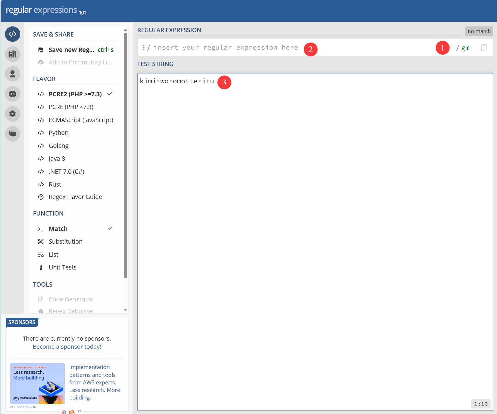

# 前言

正则表达式是一种强大的文本匹配工具，简单的说，是用来在文本中查找符合某种规则的字符串的式子 
我知道，现在网上有很多不错的正则表达式入门教程，但是我觉得**还是不够入门，还是不够简洁** 
这篇文章我打算用最简单的方式，帮助读者朋友保持效率的同时完全掌握正则表达式 

# 基础字符

**[]**

- `[]`: 匹配 `[]` 中的任意一个字符
- `[^]`: 匹配不在 `[]` 中的任意一个字符
- '[A-Z]':匹配所有大写字母
- '[a-z]':匹配所有小写字母
- '[0-9]':匹配所有数字
  💡区间可以直接堆叠,比如`[A-Za-z0-9]`匹配所有字母和数字 
  对于这段文本: `abc123` 
  `[abc]/g` 对应的匹配结果是: `abc` 
  `[^abc]/g` 对应的匹配结果是: `123` 
  💡/g所代表的含义会在后文进行介绍

**匹配方式**

- `\d`: 匹配任意一个数字字符
- `\w`: 匹配任意一个字母、数字或下划线字符
- `\s`: 匹配任意一个空白字符（包括空格、制表符、换行符等）

  💡将小写字母换为对应大写字母可以取反,比如`\D`:匹配任意一个非数字字符 
  ℹ️思考:\d,\w分别怎么用区间表示? 

- `\d`: 等于`[0-9]`
- `\w`: 等于`[A-Za-z0-9_]`
- `'.'`: 匹配任意一个字符

# 定位字符与限定字符#

定位字符与限定字符出现在表达式任意位置,可以影响匹配结果 

- `^`: 匹配字符串的开头
- `$`: 匹配字符串的结尾
- `*`: 匹配前面的元素≥0次
- `+`: 匹配前面的元素≥1次
- `?`: 匹配前面的元素0或1次
- `{n}`: 匹配前面的元素=n次
- `{n,}`: 匹配前面的元素≥n次
- `{n,m}`: 匹配前面的元素≥n次≤m次
  💡贪婪模式:默认情况下，正则表达式会尽可能多地匹配字符。比如`a*`会匹配所有的a,包括中间的a 
  💡非贪婪模式:在`*`,`+`,`?`,`{n,m}`后面添加`?`即可,比如`a*?`会只匹配到第一个a 

感到很晕？我们来实际应用一下已经学习的内容  
我们要匹配任意的邮箱地址，我们应该怎么做？

首先，想一想邮箱地址的组成：**用户名@域名.后缀**

- **用户名**：可以有字母、数字、下划线，长度任意 → 用 `\w+` 匹配
- **@**：直接书写在用户名和域名中间
- **域名**：可以有字母、数字，长度任意 → 用 `\w+` 匹配
- **.**：直接书写在域名和后缀之间
- **后缀**：可以有字母，长度任意 → 用 `[A-Za-z]+` 匹配
  ⚠️因为.在正则中是特殊字符,也就是有"实际含义"的内容,我们要在.前面添加\\,表示匹配.本身 
  将这些内容整合在一起：`\w+@\w+\.\w+`就可以匹配任意邮箱地址。

# 匹配方式修饰符

匹配修饰符在正则表达式的最后面,比如:[abc]/g,[abc]/i

- `g`: 默认状态下,正则表达式找到第一个匹配的字符就会停止,加入g修饰符可以找到所有匹配项
- `i`: 忽略大小写
- `m`: 多行匹配,默认情况下^和$只会匹配第一行,加入m修饰符允许^和$匹配每一行的开头和结尾
- `s`: 允许.可以匹配任意字符,包括换行符
  💡匹配方式修饰符可以叠加,比如/gi:同时应用找到所有匹配项与忽略大小写

# 选择与分组与断言

- `\`:转义,让有特殊含义的字符失去特殊含义
- `|`: 选择,比如`a|b`:匹配a或者b
- `()`: 分组,将匹配词作为一个整体使用,比如`(ab)+`匹配一个或多个ab
  💡分组与选择经常配合,比如我们知道gray和grey都是灰色。想要匹配gray或grey可以使用`gr(a|e)y` 
  ℹ️关于断言的部分请看通俗解释
- 正向先行断言,检查方向向右(向前),期望条件存在,语法为(?=正则表达式)
- 正向后行断言,检查方向向左(向后),期望条件存在,语法为(?<=正则表达式)
- 负向先行断言,检查方向向右(向前),期望条件不存在,语法为(?!正则表达式)
- 负向后行断言,检查方向向左(向后),期望条件不存在,语法为(?<!正则表达式)

ℹ️通俗解释

- (?=正则表达式)我要找的位置**右边必须是**正则表达式匹配的内容
- (?<=正则表达式)我要找的位置**左边必须是**正则表达式匹配的内容
- (?!正则表达式)我要找的位置**右边不能是**正则表达式匹配的内容
- (?<!正则表达式)我要找的位置**左边不能是**正则表达式匹配的内容

我们来详细举例子
我们现在要在之前匹配邮箱地址的正则表达式 `\w+@\w+\.\w+` 基础上，**排除掉所有 `@qq.com` 的邮箱地址**。
这时候，我们就需要用到 **负向先行断言** `(?!正则表达式)`
为什么? 
因为我们现在需要检查@后面的域名,所以我们确定是先行断言,方向向后 
我们需要让@后面的域名不能是qq.com,所以我们需要用负向断言,要求不能是匹配内容 
我们已知了匹配@后面的域名的正则表达式是`\w+`,我们要在这个基础上添加负向断言,要求不能是qq.com 
我们把 `@\w+` 改成 `@(?!qq\.com)\w+` 
最终的正则表达式就是：
`\w+@(?!qq\.com)\w+\.\w+`
📌附赠1:四种断言的常见别称与英文原文
| 标准名称 | 常见别称 | 英文对照 |
|------------------|--------------------------------------------------------------------------|--------------------------------------|
| 正向先行断言 | 正向先行肯定断言、先行匹配、肯定正向预查、正向前瞻 | Positive Lookahead Assertion |
| 负向先行断言 | 正向先行否定断言、先行不匹配、否定正向预查、负向前瞻 | Negative Lookahead Assertion |
| 正向后行断言 | 正向后行肯定断言、后行匹配、肯定反向预查、正向回顾 | Positive Lookbehind Assertion |
| 负向后行断言 | 正向后行否定断言、后行不匹配、否定反向预查、负向回顾 | Negative Lookbehind Assertion |

ℹ📌附赠2:常用的多种正则表达式
第一个:匹配合法车牌号 
`^[京津沪渝冀豫云辽黑湘皖鲁新苏浙赣鄂桂甘晋蒙陕吉闽贵粤青藏川宁琼使领A-Z]{1}[A-Z]{1}[A-Z0-9]{4}[A-Z0-9挂学警港澳]{1}$`
🤔这个正则表达式是如何做到的?

- ^:匹配字符串开头
- [京津沪渝冀豫云辽黑湘皖鲁新苏浙赣鄂桂甘晋蒙陕吉闽贵粤青藏川宁琼使领A-Z]{1}:匹配一个省份的汉字
- [A-Z]{1}:匹配一个大写字母
- [A-Z0-9]{4}:匹配4个字母或数字
- [A-Z0-9挂学警港澳]{1}:匹配一个字母或数字或挂学警港澳
- $:匹配字符串结尾

第二个:匹配合法手机号 
`^1[23456789]\d{9}$`
🤔这个正则表达式是如何做到的?

- ^:匹配字符串开头
- 1:匹配数字1
- [23456789]: 匹配2到9中的任意一个数字
- \d{9}:匹配9个数字位数
- $:匹配字符串结尾

第三个:匹配符合密码规则的字符串 
`^.*(?=.{6,})(?=.*\d)(?=.*[A-Z])(?=.*[a-z])(?=.*[!@#$%^&*? ]).*$`
🤔这个正则表达式是如何做到的?

- ^:匹配字符串开头
- .\*:匹配任意字符0个或多个
- (?=.{6,}):要求字符串长度至少为6个字符,可以随意替换数字来改变要求的密码长度
- (?=.\*\d):要求字符串中必须包含一个数字
- (?=.\*[A-Z]):要求字符串中必须包含一个大写字母
- (?=.\*[a-z]):要求字符串中必须包含一个小写字母
- (?=._[!@#$%^&_? ]):要求字符串中必须包含一个特殊字符
- .\*:匹配任意字符0个或多个
- $:匹配字符串结尾

第四个:匹配完全合规的邮箱地址 
`^[a-zA-Z0-9_.-]+@[a-zA-Z0-9-]+(\.[a-zA-Z0-9-]+)*\.[a-zA-Z0-9]{2,6}$`
🤔这个正则表达式是如何做到的?

- ^:匹配字符串开头
- [a-zA-Z0-9_.-]+:匹配邮箱用户名,可以包含字母、数字、下划线、点号、减号
- @:匹配@符号
- [a-zA-Z0-9-]+:匹配邮箱域名,可以包含字母、数字、减号
- (\.[a-zA-Z0-9-]+)\*:匹配邮箱域名的后缀,可以包含多个点号和减号,每个后缀可以包含字母、数字、减号
- \.[a-zA-Z0-9]{2,6}:匹配邮箱域名的后缀,必须是2到6个字母或数字
- $:匹配字符串结尾

# 总结

当你读到这里,你应该已经掌握了正则表达式的原理与四个常用的正则表达式 
正则表达式并不是很难的内容,只要你理解了原理,就可以很容易地写出符合需求的表达式 
需要注意,部分正则表达式字符在不同的编程语言中可能有不同的表示方式 
比如`\d`在Python中表示数字,而在JavaScript中表示任意字符 
当你在编程时应用正则表达式,请查阅编程语言相关文档,防止出错<br?。
个人常用的正则表达式训练与测试工网站: 
<a href="https://regex101.com/" target="_blank" class="btn btn-blue">Regex101正则表达式测试网</a>

在①中选择修饰符,②中输入正则表达式,③中输入你要匹配的文本
